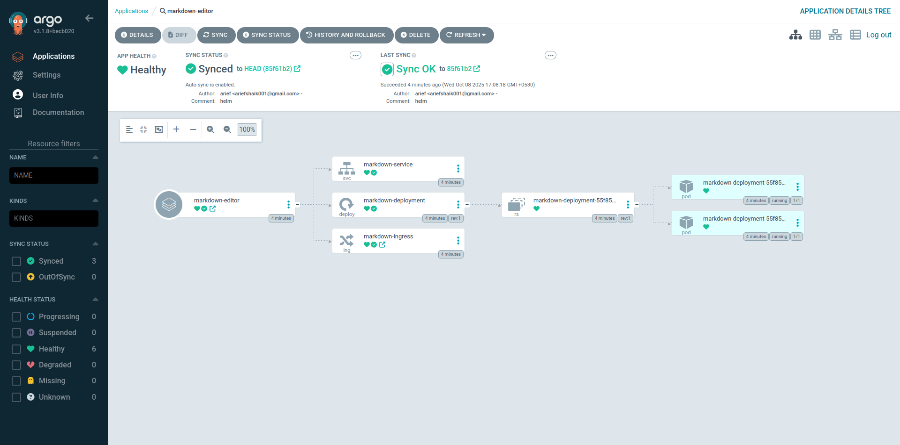

# 📝 Markdown Live Editor - Next.js Application Deployment with GitHub Actions & Kubernetes

This repository demonstrates an end-to-end DevOps pipeline, featuring a static Next.js application containerized, automatically built, published to GHCR, and deployed to Kubernetes using Helm and ArgoCD (GitOps).

## Application Overview

The core application is a **Markdown Live Editor**, built with Next.js, React, and TypeScript. It features:

  * Real-time, split-screen conversion of GitHub Flavored Markdown (GFM).
  * A fully static export build (`output: 'export'`) served by a minimal **Nginx** container for maximum efficiency.

## 🚀 Technology Stack

| Category | Technology | Detail |
| :--- | :--- | :--- |
| **Application** | Next.js, TypeScript, Tailwind CSS | Modern front-end stack built for static exporting. |
| **Containerization**| **Docker (Multi-stage Build)** | Uses `node:18-alpine` for building and `nginx:alpine` for the final runtime for a small, secure image. |
| **CI/CD Automation**| **GitHub Actions** | Automates build, test, and push on every commit to `master`. |
| **Registry** | **GHCR (GitHub Container Registry)** | Image storage, integrated directly with GitHub credentials. |
| **GitOps** | **ArgoCD** | Continuous deployment triggered by Git commits. |
| **Orchestration**| **Kubernetes / Helm** | Deployment uses Helm for templating Deployment (with health checks), Service, and Ingress. |

-----

## 📁 Project Structure

```
nextjs-k8s/
├── .github/
│   └── workflows/
│       └── ci-cd.yaml          # CI/CD pipeline
├── argocd/
│   └── argocd-app.yaml        # ArgoCD Application definition
├── helm/
│   └── markdown-chart/        # Helm Chart Root
│       ├── templates/          # K8s manifests
│       └── values.yaml          # Configuration values
└── markdown-editor/          # Next.js Application Source Code
    ├── Dockerfile            # Multi-stage build for Nginx
    └── package.json
```

-----

## 🛠️ Local Development and Run Commands

### Prerequisites

1.  Node.js (18+)
2.  Docker Desktop (or Docker Engine)

### 1\. Local Application Run (Dev Server)

To verify the Next.js app locally before the build process:

```bash
cd markdown-editor
npm install
npm run dev
```

Access at: `http://localhost:3000`

### 2\. Local Docker Build & Run

To verify the containerized application using Nginx:

```bash
# 1. Build the image (from the markdown-editor directory)
cd markdown-editor
docker build -t markdown-editor-local .

# 2. Run the container and map host port 8080 to container port 80 (Nginx)
docker run --rm -p 8080:80 markdown-editor-local
```

Access at: `http://localhost:8080`

-----

## 🚀 Automated CI/CD Workflow Details

The pipeline is triggered on push to the `main` branch (based on assessment requirements) and performs the following sequence:

1.  **Build & Push:** Uses the `markdown-editor` directory as the build context and pushes the image to **GHCR**.
2.  **Tagging:** Tags the image with a unique, immutable ID (`ghcr.io/ariefshaik7/markdown-editor:${{ github.run_id }}`).
3.  **GitOps Update:** Automatically updates the `tag` value in `helm/markdown-chart/values.yaml` using the unique ID, commits the change (using `GIT_PAT`), and pushes the commit.
4.  **ArgoCD Sync:** ArgoCD detects this change and initiates deployment.

### Required Secrets

| Secret Name | Purpose | Scope |
| :--- | :--- | :--- |
| `GIT_PAT` | **Critical:** GitHub PAT with `repo` scope to enable the workflow to commit the updated `values.yaml` back to the repository (the GitOps trigger). | `repo` |

-----

## ☁️ End-to-End Deployment Guide (K8s)

This deployment uses the Helm chart and is designed to be fully compatible with major cloud providers (AKS, EKS, GKE) and Minikube.

### Step 1: Kubernetes Cluster Setup

| Environment | Setup Instructions |
| :--- | :--- |
| **Minikube** | `minikube start --addons ingress` (Starts cluster and enables Ingress controller). |
| **Cloud (AKS/EKS/GKE)**| Ensure `kubectl` is authenticated and an **Nginx Ingress Controller** is installed (or the cloud provider's Ingress solution is active). |

---

### Step 2: Configure GHCR Image Pull Secret (Authentication)

---

Since your GHCR image is public, Kubernetes does not need to be authorized to pull it.

### Step 3: Kubernetes & ArgoCD Setup
| Orchestration    | Kubernetes (AKS, EKS, GKE, Minikube), StatefulSet |

**a. Install NGINX Ingress Controller:**
An Ingress controller is required to expose your services. For most cloud providers:


```
kubectl apply -f https://raw.githubusercontent.com/kubernetes/ingress-nginx/controller-v1.10.1/deploy/static/provider/cloud/deploy.yaml
```

**b. Install ArgoCD:**


```
kubectl create namespace argocd

kubectl create namespace argocd
kubectl apply -n argocd -f https://raw.githubusercontent.com/argoproj/argo-cd/stable/manifests/install.yaml

```

**c. Access ArgoCD:**


By default, the Argo CD API server is not exposed with an external IP. To access the API server, choose one of the following techniques to expose the Argo CD API server:
Service Type Load Balancer¶

Change the argocd-server service type to LoadBalancer:
```
kubectl patch svc argocd-server -n argocd -p '{"spec": {"type": "LoadBalancer"}}'
```
After a short wait, your cloud provider will assign an external IP address to the service. You can retrieve this IP with:
### ArgoCD Application Overview
Below is a screenshot of the ArgoCD UI showing the health and sync status of all application components:

---



---

```
kubectl get svc argocd-server -n argocd -o=jsonpath='{.status.loadBalancer.ingress[0].ip}'
```
#### Port Forwarding

Kubectl port-forwarding can also be used to connect to the API server without exposing the service.

```
kubectl port-forward svc/argocd-server -n argocd 8080:443

```
The API server can then be accessed using https://localhost:8080

#### Get initial password

```
kubectl -n argocd get secret argocd-initial-admin-secret -o jsonpath="{.data.password}" | base64 -d; echo
```

Now, navigate to `https://localhost:8080` and log in with username `admin` and the retrieved password.


If you are using a managed Kubernetes cluster, follow your provider's documentation to install these components.

---

### Step 4: Deploy the Application with ArgoCD

The `argocd/argocd-application.yaml` file defines your entire application stack for ArgoCD.

**Important:** Before applying, edit `argocd/argocd-application.yaml` and change the `repoURL` to point to **your forked repository's URL**.

    ```bash
    kubectl apply -f argocd/argocd-app.yaml
    ```

-----

## Accessing the Deployed Application

### 1\. Get the External Access Point (Ingress IP)

The Ingress will expose your application via a LoadBalancer or NodePort, depending on your cluster.

| Environment | Command to Get External IP | Notes |
| :--- | :--- | :--- |
| **Minikube** | `minikube ip` | This is the local IP you need. |
| **Cloud (AKS/EKS/GKE)** | `kubectl get svc -n ingress-nginx` | Look for the **EXTERNAL-IP** of the `ingress-nginx-controller` service (or your specific controller service). |

### 2\. Configure Local Hostname

The Ingress expects the hostname `markdown-editor.local`. You must map the IP from step 1 to this hostname in your local `hosts` file (`/etc/hosts` on Linux/macOS, or Windows equivalent):

```
<YOUR_INGRESS_IP>   markdown-editor.local
```

### 3\. Access the Application

Open your browser and navigate to:

**`http://markdown-editor.local`**

-----

## 🧹 Cleanup

To delete all resources and stop Minikube:

```bash
# 1. Delete the ArgoCD Application (deletes all K8s resources)
kubectl delete -f argocd/argocd-app.yaml

# 2. Delete the created resources (Namespace and Secret)
kubectl delete secret ghcr-pull-secret -n markdown
kubectl delete namespace markdown
kubectl delete namespace argocd

# 3. Stop Minikube (if using local environment)
minikube stop
```

---