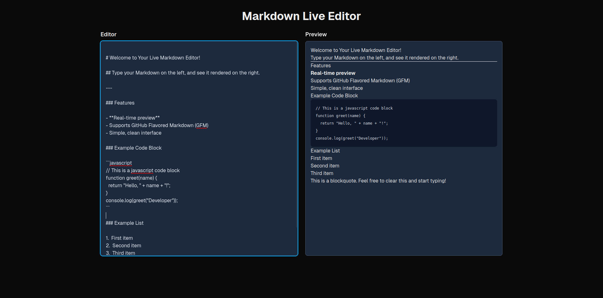

# 📝 Markdown Live Editor Application

This project is a modern, client-side web application built with Next.js, designed to provide a real-time, split-screen Markdown editing experience. It is the core application used in the surrounding DevOps assessment project.

---



---

## Application Features

  * **Real-time Preview:** Displays rendered HTML instantly as you type Markdown.
  * **GFM Support:** Supports GitHub Flavored Markdown (GFM) features like tables and task lists using `remark-gfm`.
  * **Static Export Ready:** Configured for a fully static output (`output: 'export'`) for efficient containerization and deployment via Nginx.
  * **Modern Stack:** Built using Next.js, React, and TypeScript.

## Getting Started (Local Development)

Follow these instructions to get a local development copy running.

### Prerequisites

  * Node.js (Version 18 or later)
  * npm or Yarn

### 1\. Installation

Navigate to the project directory (`markdown-editor`) and install the dependencies:

```bash
cd markdown-editor
npm install
# or
yarn install
```

### 2\. Run the Development Server

Start the Next.js development server:

```bash
npm run dev
# or
yarn dev
```

Open your browser to **`http://localhost:3000`** to see the application. The page will auto-update as you make changes to the source code.

-----

## Deployment (Containerized)

This application is designed for containerized static deployment.

### 1\. Building the Production Files

The application must be built using Next.js's static export feature. The `Dockerfile` handles these steps internally.

```bash
# This command generates the optimized static HTML/CSS/JS files in the '/out' directory.
npm run build
```

### 2\. Running in a Local Docker Container

To test the final production image locally (without Kubernetes):

```bash
# Build the image using the multi-stage Dockerfile
docker build -t markdown-editor-local .

# Run the container (Nginx serves on port 80 inside the container)
docker run --rm -p 8080:80 markdown-editor-local
```

Access the production build at: **`http://localhost:8080`**.

---